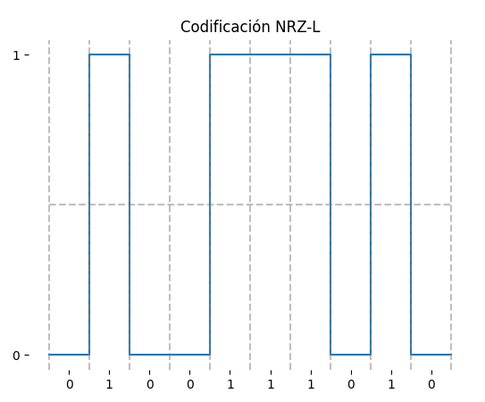
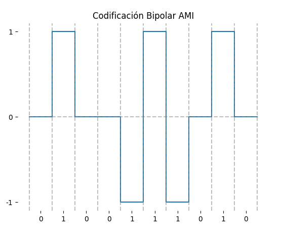
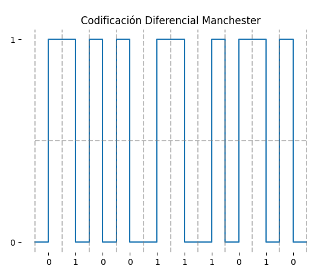

# Data Encoding Visualization

This project provides a tool to visualize various digital data encoding schemes. Given a binary string, it can generate plots for different encoding techniques, helping to understand how these schemes represent digital data as analog signals.

## Implemented Encoding Schemes

The following encoding schemes are supported:

1.  **NRZ-L (Non-Return-to-Zero-Level)**: The voltage level represents the bit value.
2.  **NRZ-I (Non-Return-to-Zero-Inverted)**: A transition in voltage level at the beginning of a bit interval represents a '1', while no transition represents a '0'.
3.  **Bipolar AMI (Alternate Mark Inversion)**: '0' is represented by no signal, and '1' is represented by a positive or negative voltage, alternating for successive '1's.
4.  **Pseudoternary**: '1' is represented by no signal, and '0' is represented by a positive or negative voltage, alternating for successive '0's.
5.  **Manchester**: Each bit period is divided into two halves. A transition occurs in the middle of each bit period. '0' is represented by a high-to-low transition, and '1' is represented by a low-to-high transition.
6.  **Differential Manchester**: A transition always occurs in the middle of each bit period. '0' is represented by an additional transition at the beginning of the bit interval, while '1' is represented by no transition at the beginning of the bit interval.

## Requirements

*   Python 3.x
*   Matplotlib

You can install Matplotlib using pip:
```sh
pip install matplotlib
```

## How to Run

1.  Ensure you have Python and Matplotlib installed.
2.  Clone or download this repository.
3.  Navigate to the project directory in your terminal.
4.  Run the main script:
    ```sh
    python main.py
    ```
5.  The program will prompt you to enter a sequence of bits (e.g., `0100110`).
6.  After entering the bit sequence, a menu will appear allowing you to select the desired encoding scheme for visualization.
7.  Choose an option from the menu to generate and display the plot.
8.  You can then choose to plot the same bit sequence with a different encoding, enter a new bit sequence, or exit the program.

## Encoding Scheme Examples

### NRZ-L




### NRZ-I


### Bipolar AMI




### Pseudoternary


### Manchester


### Differential Manchester




---